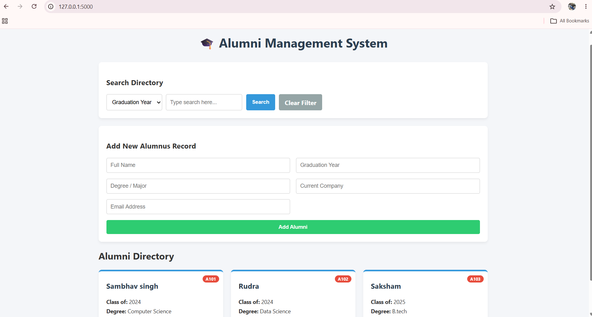

# 🎓 Alumni Management System

A full-stack web application designed to manage, track, and search university alumni records. Built in 2 days using a modular, lightweight architecture.

## 👥 Team Collaboration (MVC Pattern)
This project was built by a team of three using the Model-View-Controller design pattern to ensure parallel development:
* **Backend Database & Storage (`models.py`)**: Built the core Object-Oriented blueprints and persistent JSON data storage.
* **System Logic Controller (`controller.py`)**: Engineered the search algorithms, filters, and state management.
* **Frontend User Interface (`app.py`, templates, static)**: Designed the web GUI and web routes using Flask, HTML, and CSS.

## 🚀 Features
* **Persistent Storage:** Uses a flat-file JSON database—data is securely saved and retained even if the server restarts.
* **Dynamic ID Generation:** Automatically calculates unique alphanumeric IDs for new alumni.
* **Multi-Criteria Search:** Filter alumni instantly by graduation year or employing company.
* **Responsive Web Interface:** Modern, clean UI built from scratch using HTML5 and CSS Grid.

## 🛠️ Tech Stack
* **Language:** Python 3
* **Framework:** Flask
* **Frontend:** HTML5, CSS3, Jinja2 Templates
* **Database:** JSON (File I/O)

## 📦 Installation & Setup
1. Clone the repository: `git clone <your-repo-link>`
2. Install dependencies: `pip install flask`
3. Run the application: `python app.py`
4. Open your browser and navigate to `http://127.0.0.1:5000`